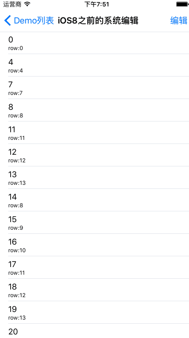

简介
===

主要实现了 UITableView 的各种编辑状态，先看效果吧：


很详细的系统编辑，我写的不一定好使，但必须要掌握系统编辑！看图：




## 一、侧滑删除（兼容iOS8之前的版本）实现：

从 iOS8 开始系统侧滑删除支持多个按钮形式，目前我们还需要兼容 iOS6 ，所以我选择 SWTableViewCell 来做侧滑删除；但是使用 Instrument 检测发现，SW 有性能问题；我的列表本可以更加流畅，但是每次滑动 cell，都需要更新侧滑按钮，即使没有显示出来！SW 创建了按钮之后还要重新布局，这些都会引起性能上的消耗，系统的侧滑高明之处在于侧滑 view 是懒加载的，只有在侧滑的时候才加载，不用的时候就会被删除...

由于使用 SW 做懒加载不太好实现，SW 侧滑的时候存在bug等原因；因此我尝试改造 iOS8 系统之前的侧滑，为了使用方便，因此封装了一套和系统一样的 API ，点击按钮的事件和 iOS8 系统原生的一样，采用 block 回调方式...

最终实现了，iOS8之后 完全使用系统的，之前版本则使用改造的，这与 SW 相比，使用方式不复杂(都需要继承)，并且性能上不存在问题（完全使用懒加载形式，仅当侧滑时才配置侧滑菜单按钮)...


SW 性能问题：


使用方法：

与 iOS8 系统原生API一样，就是把 UITableViewRowAction 改为 QLTableViewRowAction 就行了；

```objc

    - (NSArray *)tableView:(UITableView *)tableView editActionsForRowAtIndexPath:(NSIndexPath *)indexPath
    {
        QLTableViewRowAction *action1 = [QLTableViewRowAction rowActionWithStyle:QLTableViewRowActionStyleDefault title:@"1自动删除" handler:^(QLTableViewRowAction *action, NSIndexPath *indexPath) {
            //handle your click event
        }];

        QLTableViewRowAction *action2 = [QLTableViewRowAction rowActionWithStyle:QLTableViewRowActionStyleDefault title:@"2自删除" handler:^(QLTableViewRowAction *action, NSIndexPath *indexPath) {
            //handle your click event
        }];

        QLTableViewRowAction *action3 = [QLTableViewRowAction rowActionWithStyle:QLTableViewRowActionStyleNormal title:@"3删除" handler:^(QLTableViewRowAction *action, NSIndexPath *indexPath) {
            //handle your click event
        }];

        QLTableViewRowAction *action4 = [QLTableViewRowAction rowActionWithStyle:QLTableViewRowActionStyleNormal title:@"4不删除" handler:^(QLTableViewRowAction *action, NSIndexPath *indexPath) {
            //handle your click event
        }];

        NSArray *bgColors = @[[UIColor colorWithRed:255.0f/255.0f green:59.0f/255.0f blue:48.0f/255.0f alpha:1.0],
        [UIColor colorWithRed:255.0f/255.0f green:156.0f/255.0f blue:3.0f/255.0f alpha:1.0],
        [UIColor colorWithRed:255.0f/255.0f green:128.0f/255.0f blue:1.0f/255.0f alpha:1.0]];

        //configure bg color
        action2.backgroundColor = bgColors[1];
        action3.backgroundColor = bgColors[1];
        action4.backgroundColor = bgColors[2];

        if (indexPath.row == 0) {
            return @[action1];
        }else if (indexPath.row == 1){
            return @[action1,action2];
        }else if (indexPath.row == 2){
            return @[action1,action2,action3];
        }
        
        return @[action1,action2,action3,action4];
    }

```


## 二、树形列表的实现：

主要使用了系统的特性，系统 cell 是支持向右缩进的；核心代码：

```objc
	cell.indentationLevel = model.leval;
	cell.indentationWidth = 10 * cell.indentationLevel;
```
思路是把 cell 的 indentationLevel 记录在对应的 model 里；下一个层级 cell 的 indentationLevel 比当前层级大 1；这样就会自动偏移；

PS： 如果自定义 cell 的话，控件的 x 坐标记得是 ** indentationWidth ** 才能偏移！


## 三、熟悉系统支持的编辑：

理解一下属性的含义：

```objc
//正常情况下的选择，不影响编辑状态！
/*
是否允许选中；不会影响 allowsMultipleSelection；即使这个为NO，也可以多选！
*/
self.tableView.allowsSelection = NO;

/*
是否允许正常情况下多选；允许时，可通过这个属性获取选择的cell；
tableView.indexPathsForSelectedRows
*/
self.tableView.allowsMultipleSelection = NO;

//编辑情况下的选择，不影响正常状态！
/*
编辑的时候是否允许单选选中，允许时点击cell会触发：didSelectRowAtIndexPath 代理方法；
仅仅在这3种模式下生效：
UITableViewCellEditingStyleNone,
UITableViewCellEditingStyleDelete,
UITableViewCellEditingStyleInsert

如果使用 UITableViewCellEditingStyleDelete | UITableViewCellEditingStyleInsert；则没用，因为这属于多选！
*/
self.tableView.allowsSelectionDuringEditing = YES;

/*
这个属性意味着要不要开启多选！开启多选后，点击编辑完成处理选中的cell！
如果开启，就会忽略 editingStyleForRowAtIndexPath 代理方法；
不开启，就会去调用这个代理方法；
PS：还有一种开启多选的方法就是在 editingStyleForRowAtIndexPath 代理方法里返回 UITableViewCellEditingStyleDelete | UITableViewCellEditingStyleInsert；不过 allowsMultipleSelectionDuringEditing 还是 NO，不会变为YES！
*/
self.tableView.allowsMultipleSelectionDuringEditing = YES;

/**
*  侧滑是编辑的另一种形式，出现侧滑删除的条件：
1. canEditRowAtIndexPath 为 YES；
2. editingStyleForRowAtIndexPath 返回 UITableViewCellEditingStyleDelete；
3. 实现 commitEditingStyle 方法；
*
*/

/*

//默认是 UITableViewCellEditingStyleDelete；
- (UITableViewCellEditingStyle)tableView:(UITableView *)tableView editingStyleForRowAtIndexPath:(NSIndexPath *)indexPath
{
	return UITableViewCellEditingStyleDelete;
}

//默认是YES
- (BOOL)tableView:(UITableView *)tableView canEditRowAtIndexPath:(NSIndexPath *)indexPath
{
	return YES;
}

*/

//删除，插入，侧滑都会调用此方法；iOS8侧滑除外！多选不会触发这个方法！
- (void)tableView:(UITableView *)tableView commitEditingStyle:(UITableViewCellEditingStyle)editingStyle forRowAtIndexPath:(NSIndexPath *)indexPath
{

}

//重写这个方法，处理多选处理！
- (void)setEditing:(BOOL)editing animated:(BOOL)animated
{
	[super setEditing:editing animated:animated];
	NSLog(@"---%d",self.tableView.allowsMultipleSelectionDuringEditing);
}

```


## 四、多选编辑+侧滑删除：

有的时候项目里需要同时支持多选编辑和侧滑删除，在清楚了多选编辑的实现和侧滑的封装使用逻辑之后，这里很容易把他们整合到一起，基本都是系统的方法:

//开启多选编辑
- 1.self.tableView.allowsMultipleSelectionDuringEditing = YES;
- 2.cell 必须继承 QLTableViewCell;
- 3.实现这个方法；一般就是个空实现而已；
- (void)tableView:(UITableView *)tableView commitEditingStyle:(UITableViewCellEditingStyle)editingStyle forRowAtIndexPath:(NSIndexPath *)indexPath
{
//nothing,just show delete;
}
- 4.实现这个方法；不需要改动，这样复制就行了；
- (NSString *)tableView:(UITableView *)tableView titleForDeleteConfirmationButtonForRowAtIndexPath:(NSIndexPath *)indexPath
{
NSArray *actions = [self tableView:tableView editActionsForRowAtIndexPath:indexPath];
NSArray *titles  = [actions valueForKeyPath:@"title"];
return [titles componentsJoinedByString:@"拼接"];
}

上面4就实现了多选和侧滑删除；接下来配置支持的侧滑删除项以及处理回调；

```objc
//兼容 iOS8 和 之前版本；
- (NSArray *)tableView:(UITableView *)tableView editActionsForRowAtIndexPath:(NSIndexPath *)indexPath
{
	QLTableViewRowAction *action1 = [QLTableViewRowAction rowActionWithStyle:QLTableViewRowActionStyleDefault title:@"1取消" handler:^(QLTableViewRowAction *action, NSIndexPath *indexPath) {
		NSLog(@"%@",action.title);
		[self setEditing:NO animated:NO];
	}];
	
	QLTableViewRowAction *action2 = [QLTableViewRowAction rowActionWithStyle:QLTableViewRowActionStyleNormal title:@"2删除" handler:^(QLTableViewRowAction *action, NSIndexPath *indexPath) {
		NSLog(@"%@",action.title);
		
		NSObject *obj = [self.objects objectAtIndex:indexPath.row];
		[self.objects removeObject:obj];
		[tableView beginUpdates];
		[tableView deleteRowsAtIndexPaths:@[indexPath] withRowAnimation:UITableViewRowAnimationBottom];
		[tableView endUpdates];
	}];
	
	QLTableViewRowAction *action3 = [QLTableViewRowAction rowActionWithStyle:QLTableViewRowActionStyleNormal title:@"3置顶" handler:^(QLTableViewRowAction *action, NSIndexPath *indexPath) {
		NSLog(@"%@",action.title);
		NSObject *obj = [self.objects objectAtIndex:indexPath.row];
		[self.objects removeObjectAtIndex:indexPath.row];
		[self.objects insertObject:obj atIndex:0];
		
		[tableView beginUpdates];
		[tableView deleteRowsAtIndexPaths:@[indexPath] withRowAnimation:UITableViewRowAnimationLeft];
		[tableView insertRowsAtIndexPaths:@[[NSIndexPath indexPathForRow:0 inSection:0]] withRowAnimation:UITableViewRowAnimationTop];
		[tableView endUpdates];
	}];
	
	QLTableViewRowAction *action4 = [QLTableViewRowAction rowActionWithStyle:QLTableViewRowActionStyleNormal title:@"4没实现" handler:^(QLTableViewRowAction *action, NSIndexPath *indexPath) {
		NSLog(@"%@",action.title);
	}];
	
	NSArray *bgColors = @[[UIColor colorWithRed:255.0f/255.0f green:156.0f/255.0f blue:3.0f/255.0f alpha:1.0],
	[UIColor colorWithRed:255.0f/255.0f green:128.0f/255.0f blue:1.0f/255.0f alpha:1.0]];
	
	action3.backgroundColor = bgColors[0];
	action4.backgroundColor = bgColors[1];
	if (indexPath.row == 0) {
		return @[action1];
	}else if (indexPath.row == 1){
		return @[action1,action2];
	}else if (indexPath.row == 2){
		return @[action1,action2,action3];
	}

	return @[action1,action2,action3,action4];
}
```

处理多选编辑逻辑：

```objc
//重写这个方法，处理多选处理！
- (void)setEditing:(BOOL)editing animated:(BOOL)animated
{
	if (!editing) {
		NSArray *idxs = self.tableView.indexPathsForSelectedRows;
		if (!idxs) {
			[super setEditing:editing animated:YES & animated];
		}else{
			[super setEditing:editing animated:NO];
		
			NSMutableArray *objs = [NSMutableArray array];
			
			for (NSIndexPath *idx in idxs) {
				NSObject *obj = [self.objects objectAtIndex:idx.row];
				[objs addObject:obj];
			}
			[self.objects removeObjectsInArray:objs];
			[self.tableView beginUpdates];
			[self.tableView deleteRowsAtIndexPaths:idxs withRowAnimation:UITableViewRowAnimationLeft];
			[self.tableView endUpdates];
		}
	}else{
		[super setEditing:editing animated:animated];
	}
}

```
